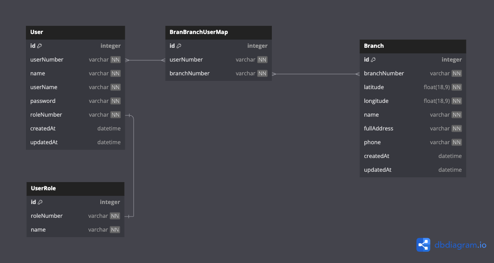
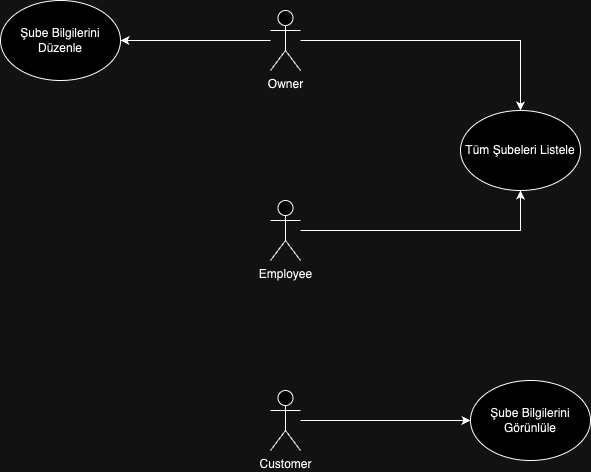

# Mindbehind Backend Challenge

## Technologies
* [Node.js](https://nodejs.org/en/)
* [Typescript](https://www.typescriptlang.org/)
* [Sequelize](https://sequelize.org/)
* [Docker](https://www.docker.com/products/docker-desktop)
* [Winston](https://github.com/winstonjs/winston)

## Kullanım

### Docker ile çalıştırma
Docker ile uygulamayı çalıştırmak için aşağıdaki komutları çalıştırın:

```bash
cd container && docker-compose up
```

### Manuel çalıştırma
Uygulamayı manuel olarak çalıştırmak için aşağıdaki komutları çalıştırın:

```bash
npm install
npm run build
npm start
```

Projeyi başlattıktan sonra, API belgelerine Swagger UI aracılığıyla erişebilirsiniz. Tarayıcınızda aşağıdaki URL'yi ziyaret edin:

```bash
http://localhost:3000/api-docs
```


## Database Schema




## Use Case Diagram


